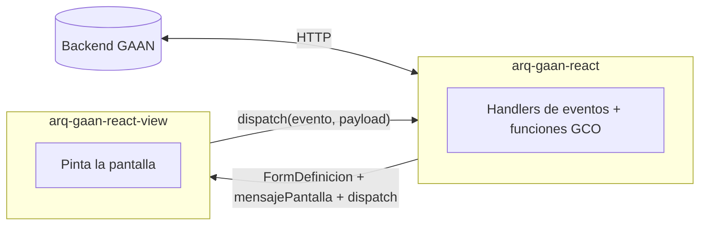
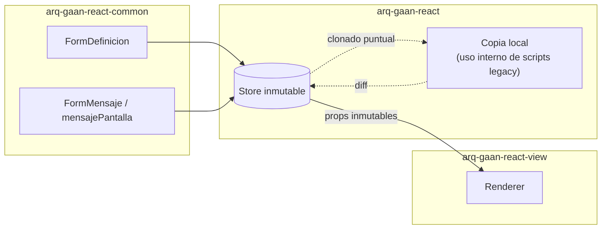
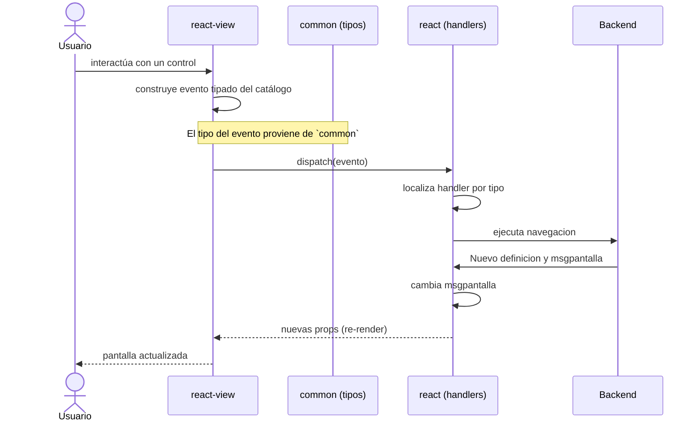

# Arquitectura del ecosistema React de GAAN

Documento de arquitectura objetivo del ecosistema React formado por los paquetes `arq-gaan-react`, `arq-gaan-react-common` y `arq-gaan-react-view`. Describe el estado final deseado: responsabilidades, contratos, flujos e invariantes.

---

## 1. Introducción y principios rectores

El ecosistema React de GAAN está formado por **tres paquetes** que cooperan para renderizar pantallas de aplicaciones sobre un backend GAAN existente:

| Paquete | Rol resumido |
|---------|--------------|
| `arq-gaan-react` | Aplicación host. Orquesta estado, comunicación con backend y ejecución de lógica legacy. |
| `arq-gaan-react-view` | Librería de renderizado puramente declarativa. Pinta formularios y emite eventos. |
| `arq-gaan-react-common` | Tipos, contratos de eventos y helpers puros compartidos. Sin dependencias de React DOM ni de red. |

Principios rectores:

- **Una sola dirección de datos.** El estado vive en `react`. `react-view` lo recibe ya resuelto y solo lo pinta.
- **Una sola dirección de eventos.** `react-view` emite eventos hacia arriba. Nunca ejecuta lógica de negocio ni habla con el backend.
- **Un único canal con backend.** Solo `react` conoce y consume el endpoint backend.
- **Contratos compartidos en `common`.** Los tipos y nombres de eventos viven en `common` para romper dependencias circulares.
- **Compatibilidad con scripts JS legacy.** Los scripts heredados se ejecutan en un entorno encapsulado que no rompe la inmutabilidad del estado React.

---

## 2. Topología del ecosistema

Lectura del diagrama:

- `react` se comunica con el backend y obtiene los datos (`FormDefinicion`, `mensajePantalla`).
- `react` envía a `view` esos datos junto con un `dispatch`.
- `view` pinta la pantalla y, si es necesario ejecutar una navegacion, modificar el msgpantalla o ejecutar evento legacy, ejecuta un `dispatch` con los datos y en `react` se ejecuta la logica.
- Dentro de `react` viven los handlers de eventos (navegar, modificar `mensajePantalla`, ejecutar scripts legacy) y las funciones GCO.
- `view` nunca habla con el backend ni ejecuta lógica.

---

## 3. Principios de diseño

### 3.1 Separación visual vs lógica

`react-view` es puramente visual y declarativo. Recibe `FormDefinicion` (qué pintar) y `mensajePantalla` (con qué datos), y emite eventos. No conoce reglas de negocio, no llama al backend, no muta estado, no ejecuta scripts.

`react` concentra toda la lógica: orquesta el estado, gestiona la sesión, llama al backend, ejecuta scripts legacy y aloja las funciones globales GCO.

### 3.2 `common` como antídoto contra ciclos

Si `react-view` necesitase tipos definidos en `react`, aparecerían dependencias circulares. `common` aloja los tipos y constantes que ambos lados necesitan compartir, sin depender de ninguno. Solo contiene código puro: tipos TypeScript, enums, constantes, helpers sin efectos secundarios.

### 3.3 Encapsulación de scripts JS legacy

Los scripts heredados están escritos asumiendo mutación directa de un objeto global tipo `mensajePantalla`. Esto choca con la inmutabilidad de React. La solución es **encapsular su ejecución**: clonar, ejecutar, calcular diff y aplicar el diff al store de forma controlada.

### 3.4 `react-view` declarativo y "tonto"

`react-view` no decide nada. Renderiza lo que recibe y emite eventos cuando el usuario interactúa. Cualquier reacción es responsabilidad de `react`.

---

## 4. Modelo de datos

Los tipos de dominio viven en `arq-gaan-react-common`. Esto permite que ambos lados los compartan sin acoplarse entre sí.

| Tipo | Propósito |
|------|-----------|
| `FormDefinicion` | Descripción declarativa del formulario: grupos, campos, layout, navs, validaciones. |
| `FormMensaje` (alias `mensajePantalla`) | Estado de datos del formulario: valor, visibilidad, habilitado, etc. por campo. |
| Tipos auxiliares | Enums de tipos de campo, layouts, navs, modos de visualización. |

Distinción importante:

- **Real**: la instancia que vive en el store de `react`. Es la única fuente de verdad.
- **Copia**: clones puntuales que se crean para ejecutar scripts legacy sin romper la inmutabilidad. Tras la ejecución, se calcula el diff y se aplica al store.

`react-view` solo ve la versión real. Nunca recibe ni manipula copias.

---

## 5. Modelo de eventos dispatch

### 5.1 Catálogo abierto en `common`

El catálogo de eventos se define en `arq-gaan-react-common`. Es **abierto**: empezamos con un conjunto inicial y se van añadiendo según necesidad. Cada evento es un tipo nominal con un payload tipado.

Eventos iniciales:

| Evento | Payload conceptual | Significado |
|--------|--------------------|-------------|
| `NAVEGAR` | identificador de navegación y datos contextuales | El control solicita ejecutar una navegacion. |
| `CAMBIAR_VALOR` | id de campo y nuevo valor | El usuario ha cambiado el valor de un campo. |
| `EJECUTAR_EVENTO` | identificador lógico + script JS legacy (string) | Disparar lógica heredada asociada a un evento de pantalla. |

Cualquier evento futuro se añade declarando su tipo y payload en `common`.

### 5.2 Contrato entre paquetes

- **`react-view` emite** eventos del catálogo. Nada más.
- **`react` consume** eventos. Cada evento tiene un handler registrado.
- **`common` define** los tipos y nombres.

### 5.3 Mecanismo de dispatch

`react` proporciona un dispatcher que `react-view` invoca al producir un evento. Un evento tipado del catálogo viaja desde `view` hasta `react`, y allí lo procesa el handler correspondiente.

---

---

## 6. Cómo añadir un evento nuevo

1. **Definir el tipo en `common`**: añadir el nombre del evento al catálogo y declarar su payload.
2. **Emitirlo desde `react-view`**: el control o flujo que lo dispara construye el evento tipado y lo manda por el dispatcher.
3. **Implementar el handler en `react`**: registrar la función que lo consume; aplicar cambios al store de forma inmutable.
4. **Backend si aplica**: si el evento requiere comunicación con backend, ampliar el cliente en `react` (no en `view`) y los DTOs en `common`.

---

## 7. Reglas de oro / invariantes

Estas invariantes definen la arquitectura. No se rompen.

1. `arq-gaan-react-view` **nunca** habla con el backend.
2. `arq-gaan-react-view` **nunca** llama a funciones `GCO.*`.
3. `arq-gaan-react-view` **nunca** muta el `mensajePantalla` ni el store.
4. `arq-gaan-react-view` solo emite eventos del catálogo definido en `common`.
5. **Toda** la comunicación con backend pasa por `arq-gaan-react` y un endpoint único.
6. Los tipos compartidos viven en `arq-gaan-react-common`; ni `react` ni `view` los declaran por su cuenta.
7. `arq-gaan-react-common` no depende de React DOM, ni de la red, ni de `window`.
8. El `mensajePantalla` es **inmutable** desde el punto de vista del store y de `view`.
9. Los scripts legacy se ejecutan **sobre copias**; los cambios se aplican al store solo vía diff + `setState`.
10. El catálogo de eventos es **abierto** y se amplía sin romper consumidores existentes.

---

## 8. Guía para crear controles

Ver la guía completa en [GUIA-CONTROLES.md](GUIA-CONTROLES.md).
