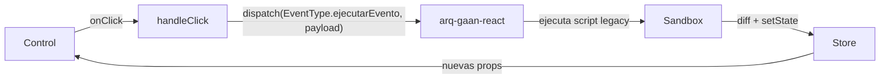

# Guía para crear controles en `react-view`

Esta guía describe el patrón que sigue todo control del proyecto `arq-gaan-react-view`, cómo se usa el dispatch para lanzar eventos hacia `arq-gaan-react` y cómo registrar un control nuevo.

Para entender el contexto general (responsabilidades de cada paquete, flujo de datos y eventos), consulta la [Arquitectura del ecosistema React](ARQUITECTURA.md).

---

## 1. Estructura de un control

Todo control es un componente React funcional que recibe `FieldComponentProps`:

```typescript
interface FieldComponentProps {
  definicion?: FieldDefinicion;  // Qué pintar: id, titulo, tipo, config (eventos, validaciones...)
  mensaje?: FieldMensaje;        // Con qué datos: Valor, Disabled, Visible, Obligatorio...
}
```

El control **no sabe de dónde vienen** esos datos ni qué pasa cuando dispara un evento. Solo pinta y emite.

---

## 2. Patrón estándar

Todos los controles siguen este esqueleto:

```typescript
import { FieldComponentProps } from "../../types";
import { useFieldConfig } from "../../common/useFieldConfig";
import { useClickEvent, useChangeEvent } from "../../common/useConfigEvent";

const MiControl: React.FC<FieldComponentProps> = (props) => {
  
  //1. Normalizar campos entrada
  const config = useFieldConfig(props, "botongrupo");

  //2. Capturar dispatch
  const { dispatch } = useGaanContext()

  //3. Evento click
  const handleClick = useClickEvent(config.definicion.eventoClick, config.definicion.navegacionClick);

  //4. Evento Change
  const handleChange = useChangeEvent(config.definicion.eventoChange);

  //5. Evento modificar valores vista
  const handleVistaChange = () => {
     dispatch(EventType.cambiarValor, { Valor: "nuevo valor control" });
  }

  // 6. Renderizar — solo visual
  return (
    <input
      id={definicion.id}
      value={definicion.initialValue}
      disabled={definicion.isDisabled || definicion.isReadOnly}
      onClick={handleClick}
      onChange={handleEventExecution}
      onValueChange={handleVistaChange}
    />
  );
};

export default MiControl;
```

---

## 3. Hooks fundamental

| Hook | Qué hace | Cuándo usarlo |
|------|----------|---------------|
| `useGaanContext()` | Obtiene funciones que se envia desde exterior (gaan-react) | Cuando se necesite llamar al dispatch para enviar evento a gaar-react  |
| `useFieldConfig(props)` | Normaliza datos entrada | Al inicio de cada control
---

## 4. Cómo se ejecuta un evento

El control **nunca lanza un evento**. El control avisa al repo contenedor que debe ejecutar un evento, con dispatch(EventType.ejecutarEvento):



El control no necesita saber qué pasa después. `react` se encarga.

---

## 5. Dispatch directo para cambio de valor

Para campos editables (textbox, número, etc.), el control informa que el usuario cambió un valor:

```typescript
const gaan = useContext(GaanContext);

// Cuando el valor cambia:
gaan.dispatch(EventType.cambiarValor, { id: config.id, value: nuevoValor });
```

Esto no ejecuta un script legacy; simplemente notifica a `react` que el `mensajePantalla` debe actualizarse con el nuevo valor. `react` se encarga de actualizar el store y re-renderizar.

Se recomienda usar debounce para campos de texto libre (evitar saturar con cada tecla).

---

## 6. Registrar el control

Añadir la entrada en el registry (`src/components/index.ts`):

```typescript
import MiControl from "./micontrol/MiControl";

const components: Record<string, React.ComponentType<FieldComponentProps>> = {
  // ... controles existentes
  micontrol: MiControl,
};
```

La clave del map es el `tipo` que viene en la `FormDefinicion`. El renderer busca automáticamente el componente por esa clave.

